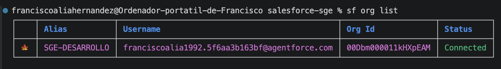

# Práctica: instalación y exploración técnica de Odoo 17

## Objetivo

En esta práctica se realizará la instalación de **Odoo 17 y PostgreSQL mediante Docker Compose** y se comprobará su correcto funcionamiento.

Una vez instalado Odoo, se activará el **modo desarrollador** para explorar cómo Odoo representa técnicamente sus modelos, campos, vistas y tablas.

!!! important "Entrega"
    El documento de entrega deberá incluir las capturas solicitadas como evidencias.  
    En cada captura debe apreciarse claramente la información que se pide comprobar.

---

## 1. Preparación del proyecto

Crea la estructura de carpetas utilizada durante la unidad:

```text
odoo/
├── docker-compose.yml
├── config_odoo/
│   └── odoo.conf
├── dev-addons/
└── log/
```

Configura `docker-compose.yml` y `odoo.conf` siguiendo los apuntes de la unidad.

### Evidencia 1 — Estructura del proyecto

Adjunta una captura donde pueda verse la estructura completa de carpetas y archivos.

**Debe apreciarse:**

- `docker-compose.yml`
- `config_odoo/odoo.conf`
- `dev-addons/`
- `log/`

---

## 2. Puesta en marcha

Desde la carpeta donde se encuentra `docker-compose.yml`, ejecuta:

```bash
docker compose up -d
```

Comprueba el estado de los contenedores:

```bash
docker compose ps
```

También puedes utilizar:

```bash
docker ps
```

### Evidencia 2 — Contenedores

Adjunta una captura donde aparezcan los contenedores de **Odoo y PostgreSQL en ejecución**.

En la captura deben poder identificarse:

- nombre o servicio;
- imagen utilizada;
- estado;
- puerto publicado de Odoo.

---

## 3. Comprobación de Odoo

Accede desde el navegador a:

```text
http://localhost:8069
```

Crea una base de datos para realizar la práctica.

Instala, como mínimo, las aplicaciones:

- **Contactos**
- **Ventas**

### Evidencia 3 — Odoo funcionando

Adjunta una captura de Odoo donde se pueda comprobar que la instalación funciona correctamente y que has accedido a la base de datos creada.

---

# 4. Activación del modo desarrollador

Para explorar la estructura interna de Odoo necesitaremos activar el **modo desarrollador**.

Puedes hacerlo desde:

**Ajustes → Herramientas de desarrollador → Activar modo desarrollador**

> Dependiendo de la interfaz instalada, la ubicación exacta puede variar.

Una vez activado aparecerán opciones técnicas adicionales.

### Evidencia 4 — Modo desarrollador

Adjunta una captura que permita comprobar que el modo desarrollador está activado.

---

# 5. Modelos de Odoo

Odoo utiliza un ORM (*Object Relational Mapping*). Los objetos de negocio se representan mediante **modelos**.

Accede a:

**Ajustes → Técnico → Estructura de la base de datos → Modelos**

Localiza los siguientes modelos:

| Modelo | Nombre técnico | Finalidad |
|---|---|---|
| Contacto | `res.partner` | Clientes, proveedores y contactos |
| Usuario | `res.users` | Usuarios de Odoo |
| Producto | `product.template` | Información general del producto |
| Pedido de venta | `sale.order` | Cabecera de los pedidos de venta |
| Línea de pedido | `sale.order.line` | Productos incluidos en cada pedido |

!!! question "Investiga"
    ¿Qué diferencia observas entre el **nombre descriptivo** de un modelo y su **nombre técnico**?

### Evidencia 5 — Modelo `res.partner`

Busca el modelo:

```text
res.partner
```

Adjunta una captura de su ficha técnica.

Localiza dentro del modelo algunos campos como:

```text
name
email
phone
city
```

Anota el **tipo de dato** de cada uno.

---

# 6. Del modelo a la tabla PostgreSQL

Una idea importante de Odoo es la relación entre el ORM y la base de datos.

Como regla general, el nombre técnico del modelo se transforma en el nombre de la tabla sustituyendo los puntos (`.`) por guiones bajos (`_`).

Ejemplo:

```text
Modelo Odoo        Tabla PostgreSQL

res.partner   →    res_partner
sale.order    →    sale_order
sale.order.line →  sale_order_line
```

Entra en PostgreSQL desde el contenedor:

```bash
docker compose exec db psql -U odoo -d NOMBRE_BASE_DATOS
```

Lista las tablas:

```sql
\dt
```

Busca algunas tablas:

```sql
\dt res_partner
\dt sale_order
\dt sale_order_line
```

Consulta la estructura de una tabla:

```sql
\d res_partner
```

También puedes realizar una consulta sencilla:

```sql
SELECT id, name, email
FROM res_partner
LIMIT 10;
```

# 7. Consultas SQL sobre la base de datos de Odoo

Una vez identificadas las tablas principales de Odoo, realiza las siguientes consultas sobre la base de datos PostgreSQL.

En este apartado **todas las consultas deberán relacionar dos o más tablas mediante `JOIN`**.

Antes de comenzar, asegúrate de disponer en Odoo de suficientes datos de prueba:

- Varios clientes.
- Al menos 5 productos.
- Al menos 3 pedidos de venta.
- Pedidos pertenecientes a diferentes clientes.
- Al menos 2 productos diferentes en cada pedido.

Los datos deberán crearse desde la interfaz de Odoo. Sobre PostgreSQL únicamente se realizarán consultas `SELECT`.

## 7.1. Pedidos y clientes

Obtén un listado de los pedidos de venta mostrando:

- Número del pedido.
- Nombre del cliente.
- Fecha del pedido.
- Estado.
- Importe total.

Ordena los pedidos desde el más reciente al más antiguo.

---

## 7.2. Productos incluidos en cada pedido

Obtén un listado que permita conocer el contenido de cada pedido.

Muestra:

- Número del pedido.
- Nombre del cliente.
- Nombre del producto.
- Cantidad.
- Precio unitario.
- Subtotal de la línea.

Ordena el resultado por número de pedido.

---

## 7.3. Pedidos realizados por cada cliente

Obtén un resumen de actividad comercial por cliente.

Muestra:

- Nombre del cliente.
- Número de pedidos realizados.
- Importe total acumulado.

Ordena los clientes de mayor a menor importe total.

---

## 7.4. Productos más vendidos

Obtén un listado de productos mostrando:

- Nombre del producto.
- Número de pedidos diferentes en los que aparece.
- Número total de unidades vendidas.
- Importe total generado por ese producto.

Ordena el resultado desde el producto que más unidades ha vendido hasta el que menos.

---

## 7.5. Productos comprados por cada cliente

Obtén un listado que permita conocer qué productos ha comprado cada cliente.

Muestra:

- Nombre del cliente.
- Nombre del producto.
- Número total de unidades compradas.
- Importe total gastado en ese producto.

Ordena el resultado primero por cliente y después por importe gastado de mayor a menor.

---

## 7.6. Clientes y comerciales

Obtén un listado de los pedidos junto con el comercial responsable.

Muestra:

- Número del pedido.
- Nombre del cliente.
- Comercial o usuario responsable.
- Fecha del pedido.
- Importe total.

---

## 7.7. Ventas realizadas por cada comercial

Genera un resumen de las ventas gestionadas por cada comercial.

Muestra:

- Nombre del comercial.
- Número de pedidos gestionados.
- Número de clientes diferentes atendidos.
- Importe total de los pedidos gestionados.

Ordena los comerciales de mayor a menor importe total.

---

## 7.8. Informe general de ventas

Realiza una consulta que genere un informe de ventas agrupado por cliente.

Para cada cliente muestra:

- Nombre del cliente.
- Número de pedidos.
- Número de productos diferentes comprados.
- Número total de unidades compradas.
- Importe total de las ventas.
- Importe medio de sus pedidos.

Ordena el resultado desde el cliente que más importe total ha generado hasta el que menos.

---

## 8. Resultado final de la instalación SalesForce

Para finalizar la práctica debemos comprobar que **Salesforce CLI está correctamente conectado con nuestra organización Developer Edition**.

Ejecutamos:

```bash
sf org list
```

Nuestra organización deberá aparecer con estado:

```text
Connected
```

Además, cada alumno deberá haber configurado su organización utilizando como alias:

```text
SGE-SU_NOMBRE
```

Por ejemplo, para un alumno llamado Carlos:

```text
SGE-CARLOS
```

El resultado deberá ser similar al siguiente:

```text
Alias          Username                         Org Id             Status
SGE-CARLOS     usuario@agentforce.com           00Dxxxxxxxxxxxx    Connected
```
Por ejemplo:



!!! success "Objetivo final"
    La práctica estará correctamente realizada cuando el alumno ejecute `sf org list` y aparezca su organización con:

    - **Alias:** `SGE-SU_NOMBRE`
    - **Status:** `Connected`

    Se deberá realizar una **captura de pantalla del terminal** donde pueda comprobarse este resultado.

## Evidencias

Para cada una de las 8 consultas deberás incluir:

1. La sentencia SQL utilizada.
2. Una captura de pgAdmin donde pueda verse la consulta y el resultado.
3. Una breve explicación de las tablas relacionadas mediante `JOIN`.


