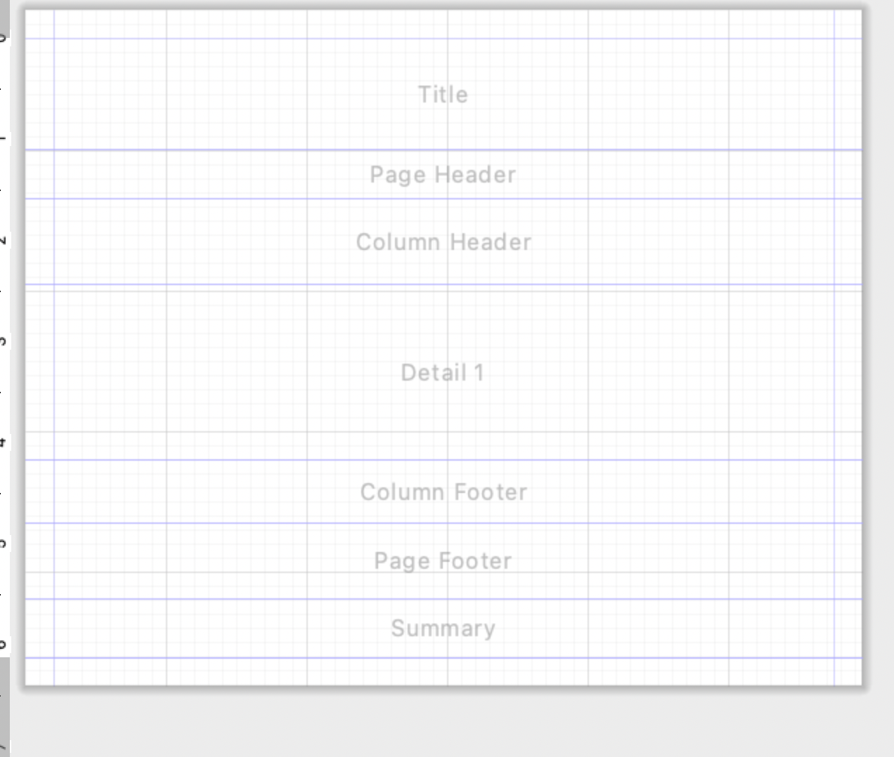

# 4. Diseñador de informes

Los informes se dividen en bandas:



**Detail** se repite por cada registro. **Title** aparece al inicio y **Summary** es útil para totales y gráficos.


Los informes de JasperReports se organizan mediante **bandas (Bands)**. Cada banda representa una zona del informe y tiene un comportamiento diferente.

La principal diferencia entre ellas es **cuándo y cuántas veces aparecen** al generar el informe.

| Banda | ¿Cuándo aparece? | ¿Para qué se utiliza? |
|---|---|---|
| **Title** | Una vez, al principio | Título, logotipo y datos generales del informe |
| **Page Header** | Al comienzo de cada página | Cabecera general de la página |
| **Column Header** | Antes de los registros | Nombres de las columnas |
| **Detail** | Una vez por cada registro | Datos obtenidos de la base de datos |
| **Column Footer** | Al finalizar las columnas | Totales o información asociada a las columnas |
| **Page Footer** | Al final de cada página | Número de página, fecha, etc. |
| **Summary** | Una vez, al final | Totales generales, estadísticas y gráficos |

---

## Title

La banda **Title** aparece normalmente **una sola vez al comienzo del informe**.

Se utiliza para mostrar información general como:

- Título del informe.
- Nombre de la empresa.
- Logotipo.
- Fecha de generación.
- Descripción del informe.

Por ejemplo:

```text
========================================
         INFORME DE PRODUCTOS
       Informática Puertollano
========================================
```

!!! warning
    No debemos utilizar `Title` para los nombres de las columnas, ya que esta banda solamente aparece al comienzo del informe.

---

## Page Header

La banda **Page Header** aparece en la parte superior de **cada página**.

Se utiliza para información que queremos repetir cuando comienza una nueva página.

Por ejemplo:

```text
Informática Puertollano S.L.        INFORME DE PRODUCTOS
---------------------------------------------------------
```

Si nuestro informe tiene 5 páginas, el `Page Header` aparecerá **5 veces**.

---

## Column Header

La banda **Column Header** contiene normalmente los **nombres de las columnas** correspondientes a los datos que mostraremos posteriormente.

Por ejemplo:

```text
Producto              Categoría          Precio      Stock
----------------------------------------------------------
```

Debajo de estos encabezados aparecerán los registros de la banda `Detail`.

---

## Detail

La banda **Detail** es una de las más importantes de JasperReports.

Se repite automáticamente **una vez por cada registro obtenido de la base de datos**.

Supongamos que ejecutamos:

```sql
SELECT nombre, precio, stock
FROM productos;
```

Y PostgreSQL devuelve 4 productos.

JasperReports procesará la banda `Detail` cuatro veces:

```text
Detail → Monitor
Detail → Teclado
Detail → Ratón
Detail → SSD
```

En esta banda colocaremos normalmente los **Fields** procedentes de la consulta:

```text
$F{nombre}
$F{precio}
$F{stock}
```

El diseño podría ser:

```text
COLUMN HEADER

Producto             Precio       Stock
----------------------------------------

DETAIL

$F{nombre}            $F{precio}   $F{stock}
```

Y al generar el informe obtendríamos:

```text
Producto             Precio       Stock
----------------------------------------
Monitor              249,99 €       12
Teclado               89,99 €        5
Ratón                  39,99 €       20
SSD                    79,99 €        8
```

!!! important
    Nosotros diseñamos **una única banda `Detail`**. JasperReports se encarga de repetirla automáticamente para cada registro.

---

## Column Footer

La banda **Column Footer** aparece al finalizar las columnas de una página.

Puede utilizarse para:

- Totales de columna.
- Información adicional.
- Elementos relacionados con el contenido de las columnas.

En informes sencillos es habitual que esta banda permanezca vacía.

---

## Page Footer

La banda **Page Footer** aparece en la parte inferior de **cada página**.

Se utiliza habitualmente para:

- Número de página.
- Fecha de impresión.
- Nombre del informe.
- Información corporativa.

Por ejemplo:

```text
----------------------------------------------------------
SGE - Curso 2026/2027                     Página 2 de 4
```

---

## Summary

La banda **Summary** aparece normalmente **una sola vez al final del informe**.

Se utiliza para mostrar información resumen:

- Número total de registros.
- Sumas.
- Promedios.
- Estadísticas.
- Totales generales.
- Gráficos.

Por ejemplo:

```text
RESUMEN
--------------------------------

Número de productos:           125
Precio medio:              105,32 €
Valor total del stock:  34.521,25 €
```

También es una zona apropiada para colocar un **gráfico resumen**.

---

## ¿Cómo se genera un informe?

Supongamos que tenemos **100 productos** y el informe ocupa 3 páginas.

JasperReports procesaría las bandas aproximadamente de esta manera:

```text
TITLE                              ← una vez

PAGE HEADER                        ← página 1
COLUMN HEADER

DETAIL → producto 1
DETAIL → producto 2
DETAIL → producto 3
...
DETAIL → producto 40

COLUMN FOOTER
PAGE FOOTER


PAGE HEADER                        ← página 2
COLUMN HEADER

DETAIL → producto 41
...
DETAIL → producto 80

COLUMN FOOTER
PAGE FOOTER


PAGE HEADER                        ← página 3
COLUMN HEADER

DETAIL → producto 81
...
DETAIL → producto 100

COLUMN FOOTER
PAGE FOOTER

SUMMARY                            ← una vez
```

!!! success "Idea fundamental"
    **Title** presenta el informe.

    **Page Header y Page Footer** se repiten en cada página.

    **Column Header** identifica las columnas.

    **Detail** se repite por cada registro obtenido de la base de datos.

    **Summary** muestra el resumen final.

---

## Ejercicio

Crea un informe llamado:

```text
prueba.jrxml
```

Configura las bandas para obtener:

- En **Title**: `MI PRIMER INFORME`.
- En **Page Header**: `Sistema de Gestión Empresarial`.
- En **Column Header**: `Producto`, `Precio` y `Stock`.
- En **Page Footer**: `SGE - Curso 2026/2027`.
- En **Summary**: `Fin del informe`.

!!! question "Comprueba"
    Ejecuta la vista **Preview** y observa qué elementos aparecen una sola vez y cuáles se repiten en cada página.
