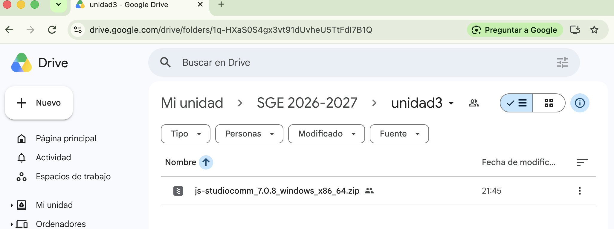
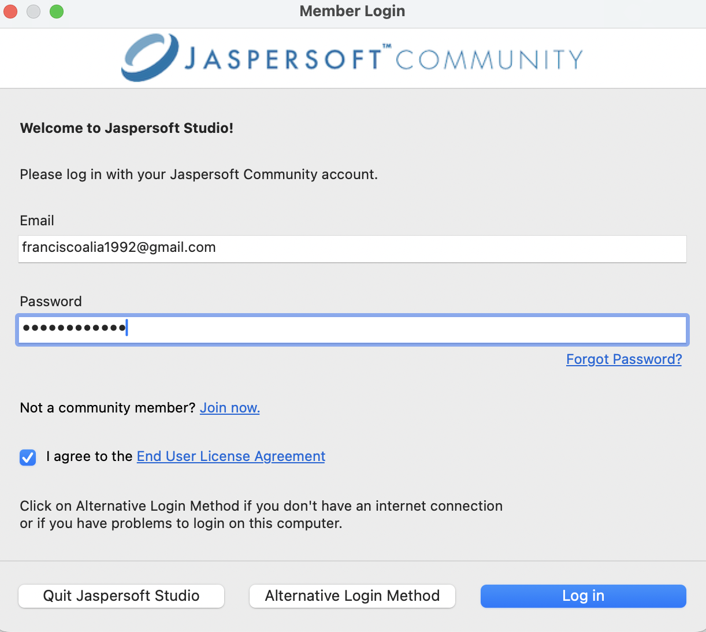

# 2. Instalación de Jaspersoft Studio

Descargaremos **Jaspersoft Studio** desde el portal oficial.

!!! warning
    No confundir Jaspersoft Studio con JasperReports Server. Para comenzar solo necesitamos Studio.

## Windows
1. Descargar la distribución de Windows.
2. Instalar o descomprimir el paquete.
3. Iniciar Jaspersoft Studio.

Para descargarlo no es necesario crearos una cuenta: En el drive de la asignatura esta disponible la versión de windows:

## macOS
1. Descargar la distribución para macOS.
2. Abrir el paquete.
3. Instalar la aplicación.
4. Ejecutar Jaspersoft Studio.

## Entorno
Trabajaremos con Project Explorer, Palette, Outline, Properties, Data Adapters y el diseñador.

## Login

PWD: SGE20262027.

