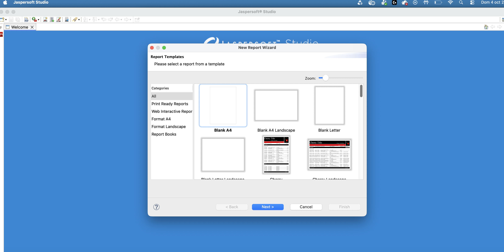
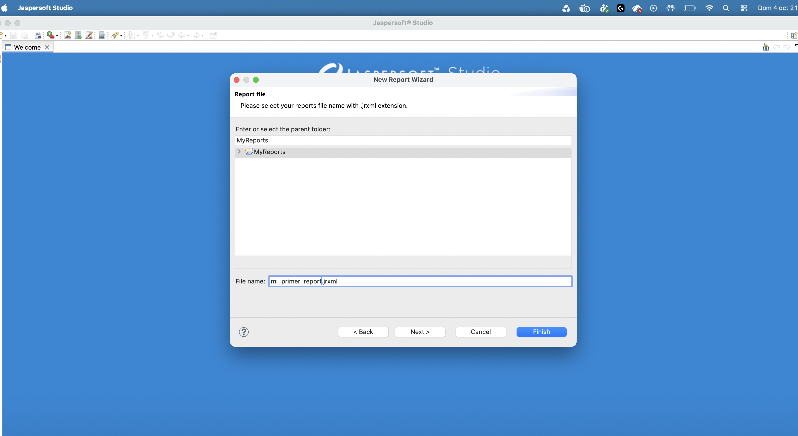

# 3. Puesta en marcha

Creamos el proyecto:

```text
SGE-JasperReports
```

Creamos un nuevo **Jasper Report** llamado `primer-informe.jrxml`.





## Vistas
- **Design**: diseño visual.
- **Source**: JRXML.
- **Preview**: resultado.

```text
DESIGN → SOURCE → PREVIEW
```
